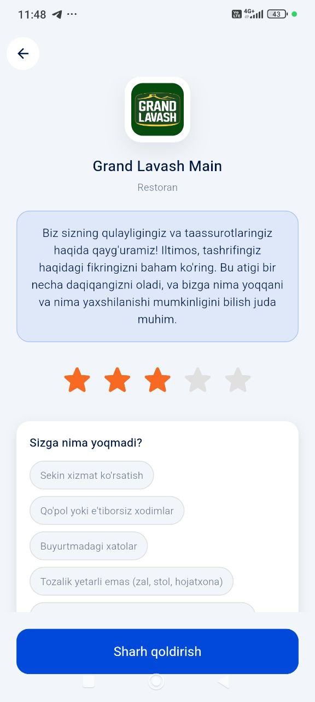
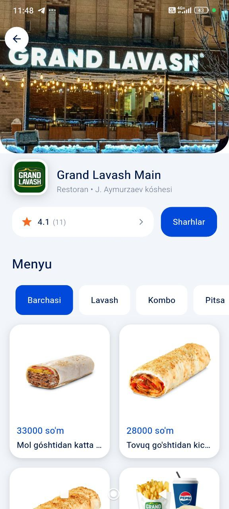
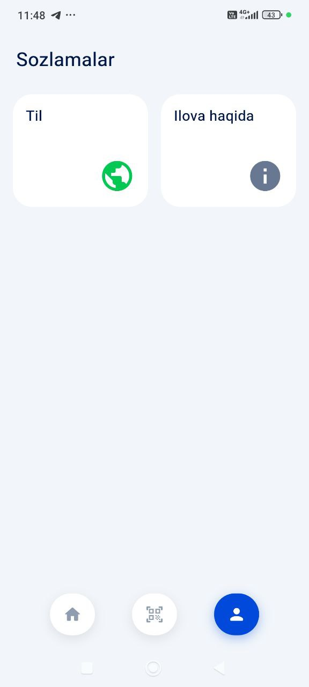
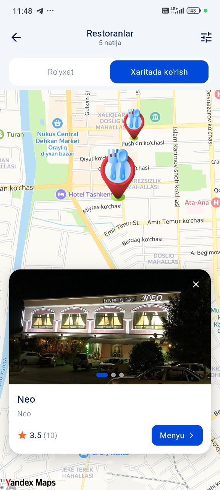
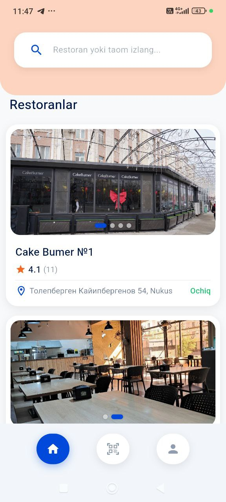
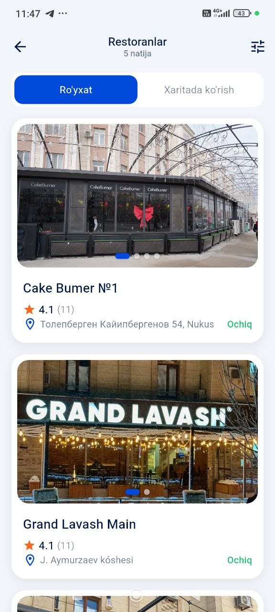
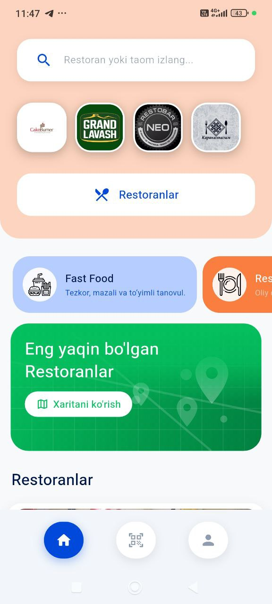

# Gastronomic — Restaurant Discovery & Review App

A Flutter mobile application for discovering restaurants, viewing menus, reading reviews and submitting feedback. Built for the Uzbekistan market with multi-language support (Karakalpak, Uzbek, Russian, English).

---

## Features

### Restaurant Discovery
- Browse all restaurants with pagination and filters
- Filter by category, city, brand, rating range
- Sort by rating or latest
- Full-text search across restaurants and menu items

### Location-Based Services
- Find nearby restaurants within a configurable radius
- Get the 5 nearest restaurants to current location
- Interactive Yandex Map with restaurant pins

### Restaurant Details
- Cover images, logo, address, phone, working hours
- Real-time open/closed status
- Full menu organized by sections (with item images, prices, weight)

### Reviews & Ratings
- View all reviews with statistics (average rating, distribution bars)
- Submit reviews with a dynamic question form (questions loaded from API)
- Conditional sub-questions shown based on selected star rating
- Guest reviews tracked by device ID (limit: 3 per day per restaurant)

### QR Code Scanner
- Scan a table QR code → navigate directly to that restaurant's page

### Settings & Localization
- 4 language support: Karakalpak (`kaa`), Uzbek (`uz`), Russian (`ru`), English (`en`)
- Language selection persisted across sessions

---

## Architecture

The project follows **Clean Architecture** with the **BLoC** state management pattern.

```
lib/
├── core/                          # Cross-cutting concerns
│   ├── constants/
│   │   └── api_constants.dart     # Base URL and all API endpoints
│   ├── l10n/
│   │   └── app_localizations.dart # 4-language translation map
│   ├── mixins/
│   │   └── restaurant_navigation_mixin.dart
│   ├── services/
│   │   ├── connectivity_service.dart
│   │   └── location_service.dart
│   ├── theme/
│   │   ├── app_colors.dart
│   │   └── app_theme.dart
│   └── utils/
│       └── device_id_helper.dart
│
├── data/                          # Data layer
│   ├── datasources/remote/        # HTTP API calls
│   │   ├── restaurant_remote_datasource.dart
│   │   ├── menu_remote_datasource.dart
│   │   ├── review_remote_datasource.dart
│   │   ├── search_remote_datasource.dart
│   │   └── category_remote_datasource.dart
│   ├── models/                    # JSON ↔ Entity parsers
│   │   ├── restaurant_model.dart
│   │   ├── menu_model.dart
│   │   ├── review_model.dart
│   │   └── search_model.dart
│   └── repositories/              # Repository implementations
│
├── domain/                        # Domain layer (pure Dart, no Flutter)
│   ├── entities/                  # Business objects
│   │   ├── restaurant.dart
│   │   ├── menu.dart
│   │   └── review.dart
│   ├── repositories/              # Abstract interfaces
│   └── usecases/                  # Single-responsibility business logic
│       ├── get_restaurants_usecase.dart
│       ├── get_nearby_restaurants_usecase.dart
│       ├── get_nearest_restaurants_usecase.dart
│       ├── get_restaurant_detail_usecase.dart
│       ├── get_restaurant_menu_usecase.dart
│       ├── get_reviews_usecase.dart
│       ├── create_review_usecase.dart
│       ├── search_usecase.dart
│       └── get_categories_usecase.dart
│
└── presentation/                  # UI layer
    ├── bloc/
    │   ├── restaurant_bloc.dart
    │   ├── settings_bloc.dart
    │   └── category_bloc.dart
    ├── pages/
    │   ├── splash_screen.dart
    │   ├── intro_screen.dart
    │   ├── main_screen.dart
    │   ├── home_screen.dart
    │   ├── restaurant_list_screen.dart
    │   ├── restaurant_detail_screen.dart
    │   ├── restaurant_reviews_screen.dart
    │   ├── review_screen.dart
    │   ├── map_screen.dart
    │   ├── qr_scanner_screen.dart
    │   └── settings_screen.dart
    └── widgets/
        ├── connectivity_wrapper.dart
        ├── image_carousel.dart
        ├── map_restaurant_card.dart
        ├── no_internet_screen.dart
        ├── restaurant_card.dart
        └── state_widgets.dart
```

---

## Screens

| Screen | Description |
|--------|-------------|
| `SplashScreen` | App init — shows intro on first launch, main screen otherwise |
| `IntroScreen` | 4-page onboarding carousel |
| `MainScreen` | Bottom navigation (Home / QR Scanner / Settings) |
| `HomeScreen` | Restaurants, categories, search, nearby/map shortcuts |
| `RestaurantListScreen` | Paginated list with filters and sorting |
| `RestaurantDetailScreen` | Images, menu, info, review entry point |
| `RestaurantReviewsScreen` | Reviews list with stats, load-more pagination |
| `ReviewScreen` | Dynamic review form (questions fetched from API) |
| `MapScreen` | Yandex Map with restaurant pins |
| `QrScannerScreen` | Camera QR scanner → restaurant navigation |
| `SettingsScreen` | Language picker + About |

---

## Screenshots

<table>
  <tr>
    <td></td>
    <td></td>
    <td></td>
  </tr>
  <tr>
    <td></td>
    <td></td>
    <td></td>
  </tr>
  <tr>
    <td></td>
    <td></td>
    <td></td>
  </tr>
</table>

---

## API

**Base URL:** defined in `lib/core/constants/env.dart` (gitignored — see setup below)

| Endpoint | Method | Description |
|----------|--------|-------------|
| `/api/restaurants` | GET | All restaurants (filters + pagination) |
| `/api/restaurants/{id}` | GET | Restaurant detail |
| `/api/restaurants/{id}/menu` | GET | Menu by section |
| `/api/restaurants/{id}/reviews` | GET | Reviews + statistics |
| `/api/restaurants/{id}/reviews` | POST | Submit a review |
| `/api/restaurants/map` | GET | All restaurants for map |
| `/api/restaurants/nearby` | GET | Restaurants within radius |
| `/api/restaurants/nearest` | GET | Nearest 5 restaurants |
| `/api/categories` | GET | All categories |
| `/api/categories/{id}/top-restaurants` | GET | Top-rated by category |
| `/api/menu-items/{id}` | GET | Single menu item detail |
| `/api/search` | GET | Global search (restaurants + menu items) |
| `/api/questions` | GET | Dynamic review form questions |

All endpoints accept `Accept-Language: uz | ru | kk | en` header.

### Submit Review — Request Body

```json
{
  "device_id": "uuid-string",
  "rating": 5,
  "comment": "Optional text comment",
  "phone": "+998901234567",
  "selected_option_ids": [1, 5, 12, 15]
}
```

---

## Technologies

### Core

| Package | Version | Purpose |
|---------|---------|---------|
| `flutter` | SDK | UI framework |
| `dart` | ^3.10.3 | Language |

### State Management

| Package | Version | Purpose |
|---------|---------|---------|
| `flutter_bloc` | ^8.1.3 | BLoC state management |
| `bloc_concurrency` | ^0.2.5 | Concurrent event handling (droppable / restartable) |
| `provider` | ^6.1.1 | DI / service locator |
| `equatable` | ^2.0.5 | Value equality for BLoC states/events |

### Networking

| Package | Version | Purpose |
|---------|---------|---------|
| `http` | ^1.1.0 | REST API calls |
| `connectivity_plus` | ^5.0.2 | Internet connectivity monitoring |

### Storage

| Package | Version | Purpose |
|---------|---------|---------|
| `shared_preferences` | ^2.2.2 | Persistent key-value storage (language, intro flag) |

### Location

| Package | Version | Purpose |
|---------|---------|---------|
| `geolocator` | ^10.1.0 | GPS coordinates |
| `permission_handler` | ^11.1.0 | Runtime permission requests |

### Maps

| Package | Version | Purpose |
|---------|---------|---------|
| `yandex_mapkit` | ^4.2.1 | Yandex Maps SDK integration |

### QR Code

| Package | Version | Purpose |
|---------|---------|---------|
| `mobile_scanner` | ^3.5.5 | Camera-based QR code scanning |

### UI

| Package | Version | Purpose |
|---------|---------|---------|
| `flutter_svg` | ^2.0.9 | SVG asset rendering |
| `cached_network_image` | ^3.3.0 | Network image caching |
| `shimmer` | ^3.0.0 | Skeleton loading shimmer |
| `cupertino_icons` | ^1.0.8 | iOS-style icons |
| `flutter_localizations` | SDK | i18n delegate support |

### Utilities

| Package | Version | Purpose |
|---------|---------|---------|
| `uuid` | ^4.2.1 | Device ID generation |

---

## Android Configuration

| Parameter | Value |
|-----------|-------|
| **Application ID** | `uz.visionsystemcorp.gastronomic` |
| **Min SDK** | 26 (Android 8.0 Oreo) |
| **Java / Kotlin JVM** | 17 |
| **Build type** | Release: minify + resource shrink enabled |
| **Maps SDK** | `com.yandex.android:maps.mobile:4.22.0-lite` |

### Required Permissions

```xml
<uses-permission android:name="android.permission.INTERNET" />
<uses-permission android:name="android.permission.ACCESS_NETWORK_STATE" />
<uses-permission android:name="android.permission.ACCESS_FINE_LOCATION" />
<uses-permission android:name="android.permission.ACCESS_COARSE_LOCATION" />
<uses-permission android:name="android.permission.CAMERA" />
```

---

## Localization

The app supports 4 languages managed in a single file (`app_localizations.dart`):

| Code | Language | Region |
|------|----------|--------|
| `kaa` | Karakalpak | Karakalpakstan (default) |
| `uz` | Uzbek | Uzbekistan |
| `ru` | Russian | CIS |
| `en` | English | International |

Language is stored in `SharedPreferences` and mapped to API `Accept-Language` header (`kaa` → `uz` for API calls).

---

## Design System

| Token | Value | Usage |
|-------|-------|-------|
| `primary` | `#0049DB` | Buttons, active states, accents |
| `background` | `#F2F6FA` | Page background |
| `card` | `#FFFFFF` | Cards, containers |
| `textPrimary` | `#001849` | Main headings and body text |
| `textSecondary` | `#687792` | Subtitles, hints |
| `starRating` | `#FFB800` | Rating stars |
| `success` | `#34C759` | Positive feedback |
| `error` | `#FF3B30` | Errors, destructive actions |

---

## Getting Started

### Prerequisites
- Flutter SDK ≥ 3.10.3
- Android Studio or VS Code with Flutter plugin
- Android device / emulator with API 26+

### Setup

```bash
# Clone the repository
git clone <repository-url>
cd gastronomic

# Configure environment
cp lib/core/constants/env.example.dart lib/core/constants/env.dart
# Then open env.dart and set your real API base URL

# Install dependencies
flutter pub get

# Run on connected device
flutter run

# Build release APK
flutter build apk --release
```

> **Note:** `lib/core/constants/env.dart` is listed in `.gitignore` and must never be committed.

---

## Project Info

| Field | Value |
|-------|-------|
| **Developer** | DMO Karakalpakstan |
| **Platform** | Android (min API 26) & iOS |
| **Version** | 1.0.0+1 |